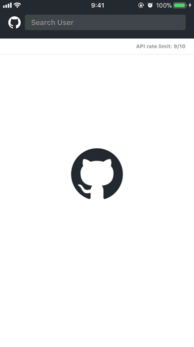

# VueFluxExample-GitHub
This is an example project of [VueFlux and VueFluxReactive](https://github.com/ra1028/VueFlux) using GitHub `GET /search/users` API.  

## :clipboard: Requirements
- Swift4.1+
- Xcode9.3+
- iOS 11.0+

##  :rocket: Checking out Example & Dependencies
In order to install the dependencies, install [Carthage](https://github.com/Carthage/Carthage) beforehand and run `make` or `make bootstrap` command in the root directory.  

##  :warning: GitHub API Rate Limiting
GitHub search API has a [rate limit rules](https://developer.github.com/v3/search/#rate-limit).  
For unauthenticated requests, the rate limit allows you to make up to 10 requests per minute.  
Enable Basic Authentication by enter your [GitHub personal access token](https://github.com/settings/tokens) for `GitHubAccessToken` key in `info.plist`, the rate limit allows you to make up to 30 requests per minute.
